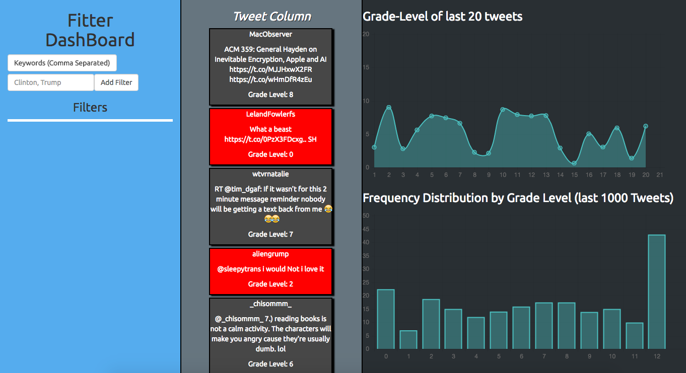

# Fitter - Twitter Filtering API in Java
Created and pair programmed by [David Sudia](https://github.com/dsudia) and [Ben Hernandez](https://github.com/benaychh).

Currently not deployed as we cannot afford the AWS time to process 5 million tweets per day.

New home repo for this project as it is rebuilt using Spark.

See http://githbub.com/dsudia/java-twitter-api for current build in Spring.

For an example of a product using this API, look at [this demo client](https://github.com/BenAychh/react-twitter-client).

## Uses and Users
Fitter is a standalone API. It can be used to filter tweets in a variety of ways and send those filtered tweets on to a front-end client. Its users are people who want to build a client that can present these filtered tweets to end-users.

## Technologies Involved
Fitter is built in Java using the SparkJava platform. It was previously written in Spring, but Spring's security opinions were not well-suited for Cross-Origin websocket requests. Client information is stored in MongoDB. It uses Twitter's HoseBird Client to access Twitter's 1% public firehose of tweets. The project uses JUnit for unit testing and Travis for continuous integration.

## Features
Fitter filters keyword search and/or Kincaid readability score depending on query parameters sent in a websocket message. Future filters will include sentiment analysis powered by Stanford Core-NLP and username search. It continues to steam tweets matching the selected filters until the connection is closed by the client. Users can sign up for a key so they can build a client that accesses the API, and view the API docs for building their own client to specification.

## Project Tracking
[Pivotal Tracker](https://www.pivotaltracker.com/n/projects/1572541)
